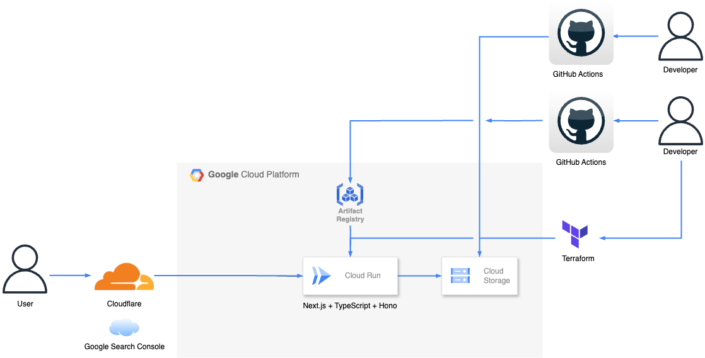

# ポータルWebアプリケーション(フロント側 + バックエンド側)(リニューアル版)

## Summary

- 私のポータルWebサイトがリニューアルしました。

- 以下が解消されました。
    - デザインのリニューアル
    - Vercel → Cloud Runによりインフラの統一化
    - Cloudflareによりセキュリティ強化
    - Cloud Storageによりリソースの分離

## Site

以下URLで公開しています。

[該当サイト](https://smartportalcom.com/)

## Tech Stack

## Architecture

## Archived

アーカイブ用リポジトリは以下になります。
※非公開分は未記載。

[Web側リポジトリ](https://github.com/kojikawazu/archived-nextjs-portal-app)
