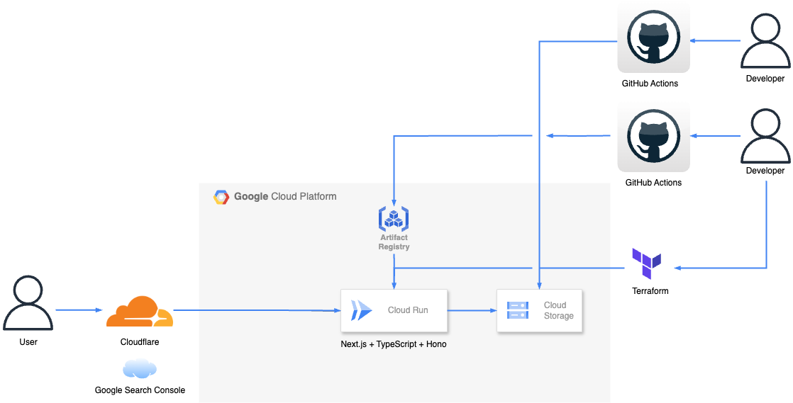

# My Developers Hub — ポータルWebアプリケーション

[](https://github.com/kojikawazu/nextjs-hono-portal-web-app/actions/workflows/deploy-to-googlecloud.yml)

個人の技術活動（ポートフォリオ・個人開発・サンプル開発）を一元的に公開し、問い合わせ導線を備えたポータルサイト。**Next.js（フロント）+ Hono（バックエンド）の一体型アプリ**を Docker 化し、Google Cloud Run にデプロイしています。

🔗 **公開サイト**: <https://smartportalcom.com/>

---

## 目次

- [機能](#機能)
- [スクリーンショット](#スクリーンショット)
- [技術スタック](#技術スタック)
- [アーキテクチャ](#アーキテクチャ)
- [必要要件](#必要要件)
- [セットアップ（ローカル開発）](#セットアップローカル開発)
- [よく使うコマンド](#よく使うコマンド)
- [環境変数](#環境変数)
- [テスト](#テスト)
- [デプロイ](#デプロイ)
- [ドキュメント](#ドキュメント)
- [アーカイブ](#アーカイブ)

---

## 機能

| 画面 / 機能 | 説明 |
|---|---|
| ホーム (`/`) | ヒーローセクション + ナビゲーション。外部ポートフォリオ・問い合わせへの導線 |
| 個人開発履歴 (`/personaldev`) | GCS から取得した個人開発プロジェクトをカード一覧で表示 |
| サンプル開発履歴 (`/sampledev`) | 画像付きのサンプル開発を 2 列グリッドで表示 |
| お問い合わせ (`/contact/form → /confirm → /success`) | 入力 → 確認 → 送信完了の 3 ステップフロー |
| メール送信 API (`POST /api/mail/send`) | Resend 経由でメール送信。CSRF トークンで保護 |
| GCS データ取得 API (`GET /api/gcs/*`) | コンテンツ（共通 / 個人 / サンプル）を GCS の JSON から取得 |

> ユーザー認証・CMS・DB は**スコープ外**。コンテンツは GCS 上の JSON で管理します。

## スクリーンショット

実際の画面は公開サイト <https://smartportalcom.com/> を参照してください。

<!-- TODO: UI スクリーンショットを docs/images/ 配下に追加し、ここに埋め込む
例:


-->

## 技術スタック

### フロントエンド
[](https://nextjs.org/)
[](https://www.typescriptlang.org/)
[](https://tailwindcss.com/)
[](https://react-hook-form.com/)
[](https://github.com/colinhacks/zod)
[](https://fontawesome.com/)

App Router + Client Components 構成。フォームは React Hook Form + Zod、アニメーションは Framer Motion。

### バックエンド
[](https://hono.dev/)
[](https://resend.com/)

Hono を Next.js の Catch-all API Route (`/api/[[...route]]`) にマウント。メール送信は Resend。

### インフラ / デプロイ
[](https://www.cloudflare.com/)
[](https://cloud.google.com/run)
[](https://cloud.google.com/storage)
[](https://cloud.google.com/artifact-registry)
[](https://www.docker.com/)
[](https://www.terraform.io/)
[](https://github.com/features/actions)

Cloudflare（CDN/WAF）→ Cloud Run（コンテナ）。データは GCS、IaC は Terraform、CI/CD は GitHub Actions。

### 開発ツール
[](https://pnpm.io/)
[](https://prettier.io/)
[](https://jestjs.io/)
[](https://playwright.dev/)

パッケージ管理は pnpm。ユニットテストは Jest、E2E は Playwright、整形は Prettier + ESLint。

## アーキテクチャ



```
[ユーザー] → [Cloudflare (CDN/WAF)] → [Cloud Run コンテナ]
                                          └ Next.js + Hono API
                                              ├ /api/gcs/*  → Google Cloud Storage
                                              └ /api/mail/* → Resend
```

詳細は [docs/09-architecture-specification/](./docs/09-architecture-specification/) を参照。

## 必要要件

- **Node.js 20+**
- **pnpm 10.33.0**（`corepack` 経由で有効化。`package.json` の `packageManager` に固定）
- （任意）コンテンツ表示には Google Cloud Storage、問い合わせ送信には Resend のアカウント

## セットアップ（ローカル開発）

> このリポジトリはモノレポ構成です。アプリ本体（Next.js + Hono）は **`front/`** に集約されており、開発コマンドは `front/` ディレクトリで実行します。

```bash
# 1. クローン
git clone https://github.com/kojikawazu/nextjs-hono-portal-web-app.git
cd nextjs-hono-portal-web-app

# 2. pnpm を有効化（未設定の場合）
corepack enable

# 3. アプリ本体（front/）へ移動
cd front

# 4. 依存をインストール
pnpm install

# 5. 環境変数を用意（.env.example をコピーして値を設定）
cp .env.example .env

# 6. 開発サーバを起動 → http://localhost:3000
pnpm dev
```

> GCS / Resend の値が未設定でも起動はできます。その場合、コンテンツ一覧は空表示・メール送信は失敗します（[docs/04](./docs/04-non-functional-specification.md) のエラーハンドリング参照）。

## よく使うコマンド

> `pnpm` コマンドは `front/` ディレクトリで実行します。`make` コマンドは **ルート直下**で実行でき、内部で `front/` に委譲するため `cd` は不要です（全ターゲットは `make help` を参照）。

| pnpm（`front/`） | make（ルート） | 内容 |
|---|---|---|
| `pnpm install` | `make install` | 依存をインストール |
| `pnpm dev` | `make dev` | 開発サーバ起動（http://localhost:3000） |
| `pnpm build` | `make build` | 本番ビルド |
| `pnpm start` | `make start` | ビルド成果物を起動 |
| `pnpm lint` | `make lint` | ESLint（`src/`） |
| `pnpm format` / `format:check` | `make format` / `make format-check` | Prettier で整形 / チェック |
| `pnpm test` | `make test` | Jest ユニットテスト（`test-watch` / `test-coverage` も可） |
| `pnpm test:it:docker` | `make test-it-docker` | 統合テスト（fake-gcs-server 自動起動〜停止） |
| `pnpm test:e2e` | `make e2e` | Playwright E2E（`e2e-ui` / `e2e-headed` も可） |
| — | `make ci` | CI 相当を一括実行（format:check → lint → UT → IT） |
| — | `make tf-init` / `tf-plan` / `tf-apply` | Terraform（`terraform/`） |

## 環境変数

`front/` で `cp .env.example .env` して雛形を作成し、各値を設定します（`.env` は `front/` 直下に置きます）。アプリが読み込むのは以下の 9 変数です。

| 変数 | 必須 | 用途 |
|---|---|---|
| `NODE_ENV` | ○ | 実行環境（development / production） |
| `ALLOWED_ORIGIN` | ○ | CORS 許可オリジン |
| `GCS_PRIVATE_BUCKET_NAME` | ○ | GCS バケット名 |
| `GCS_COMMON_DATA_PATH` | ○ | 共通データ JSON パス |
| `GCS_PERSONAL_DATA_PATH` | ○ | 個人開発データ JSON パス |
| `GCS_SAMPLE_DATA_PATH` | ○ | サンプル開発データ JSON パス |
| `MY_MAIL_ADDRESS` | ○ | 問い合わせメールの送信先 |
| `RESEND_API_KEY` | ○ | Resend API キー |
| `RESEND_SEND_DOMAIN` | ○ | Resend 送信ドメイン |

完全な一覧・取得方法・レガシー変数の扱いは [docs/10-miscellaneous-specification.md](./docs/10-miscellaneous-specification.md) と [manuals/environments.md](./manuals/environments.md) を参照。

## テスト

```bash
pnpm test        # ユニット（Jest / GCS API）
pnpm test:e2e    # E2E（Playwright / 各ページ・メール送信API）
```

テスト方針・分類は [docs/08-test-specification.md](./docs/08-test-specification.md) を参照。

## デプロイ

`main` への push をトリガーに GitHub Actions が **テスト → Docker ビルド → Artifact Registry へ push → Cloud Run へデプロイ** を実行します（PR のマージは人間が行う運用）。

- パイプライン詳細: [docs/09-architecture-specification/deploy-design.md](./docs/09-architecture-specification/deploy-design.md)
- インフラ構築手順: [manuals/](./manuals/)（[google_cloud.md](./manuals/google_cloud.md) / [cloudflare.md](./manuals/cloudflare.md) / [terraform.md](./manuals/terraform.md)）

## ドキュメント

仕様書は [docs/](./docs/) に集約しています（目次: [docs/README.md](./docs/README.md)）。

| ドキュメント | 内容 |
|---|---|
| [docs/README.md](./docs/README.md) | 仕様書の目次 |
| [.claude/rules/](./.claude/rules/) | 開発ルール（フロー・Git・テスト・ドキュメント運用など） |
| [manuals/](./manuals/) | 環境変数・インフラ構築マニュアル |

## アーカイブ

旧リポジトリ（※非公開分は未記載）:

- [Web側リポジトリ（archived）](https://github.com/kojikawazu/archived-nextjs-portal-app)
