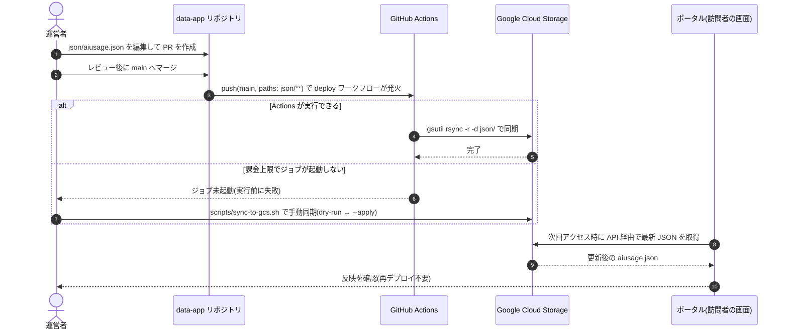

# publish-aiusage-data

このファイルは**シーケンス仕様の正本**です。`docs/mockups/sequence-publish-aiusage-data.html` は、このファイルからのレンダリング結果です。

## 概要

サイト運営者（本人）が掲載内容を書き換えてから、訪問者の画面に反映されるまでの運用フロー。**Web アプリ側の再デプロイは不要**で、データリポジトリの更新と GCS への同期だけで反映される。

## アクター

| キー | 名称 | 種別 |
|---|---|---|
| O | 運営者（本人） | user |
| R | data-app リポジトリ | external |
| C | GitHub Actions | server |
| G | Google Cloud Storage | external |
| F | ポータル（訪問者の画面） | front |

## シーケンス

## 補足ノート

| ステップ | 補足 |
|---|---|
| 3 | `deploy-cloud-storage.yml` は `json/**` の変更でのみ発火する（ドキュメント修正でデータ配信を走らせない） |
| 4 | 同期は `rsync -d`。**コピー元に無いファイルは宛先から削除される**ため、ファイルを消すと GCS からも消える |
| else 分岐 | data-app は private リポジトリで Actions が課金対象。上限に達するとジョブが起動しないため、手動同期が必要になる（README「データの反映」） |
| 手動同期 | スクリプトは既定 dry-run で、削除を検出すると中断する。削除が意図どおりのときだけ `--allow-delete` を付ける |
| 9 | 消費側は実行時に GCS から取得するため、**ポータルの再デプロイは不要** |

## 関連画面

| 画面ID | このフローでの役割 |
|---|---|
| visitor-aiusage | 終了（更新内容が反映される画面） |
