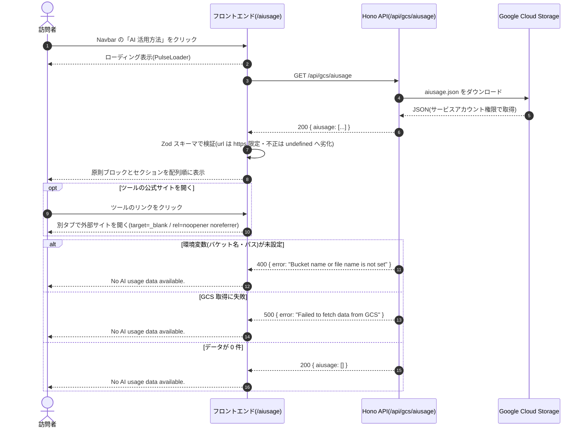

# view-aiusage

このファイルは**シーケンス仕様の正本**です。`docs/mockups/sequence-view-aiusage.html` は、このファイルからのレンダリング結果です。

## 概要

訪問者が Navbar から AI 活用方法ページを開き、GCS 上の JSON から取得した AI 活用の内容（原則・4 セクション）を閲覧する。取得に失敗した場合もページはクラッシュさせず、空状態の表示にフォールバックする。

## アクター

| キー | 名称 | 種別 |
|---|---|---|
| U | 訪問者 | user |
| F | フロントエンド（`/aiusage`） | front |
| A | Hono API（`GET /api/gcs/aiusage`） | server |
| G | Google Cloud Storage | external |

## シーケンス

## 補足ノート

| ステップ | 補足 |
|---|---|
| 3 | 取得は `repositories/` の関数からのみ行う（`frontend.md`「`fetch` を書いてよいのは `repositories/` だけ」）。フックは状態管理に専念する |
| 4 | バケットは private。ブラウザから直接は読めず、**サーバー（Hono）がサービスアカウント権限で取得して中継**する |
| 7 | 検証は `schemas/` の Zod スキーマ。`url` は `optionalHttpsUrlSchema` を合成し、`javascript:` 等は `undefined` へ劣化させる（[06-security-specification/application.md](../../06-security-specification/application.md) §4）。`decision` も任意項目 |
| 9-10 | 外部リンクは必ず `rel="noopener noreferrer"` を付ける。**非公開リポジトリには `url` を付けない**ため、リンクを持たない項目が多数を占める |
| alt 全体 | **失敗の種類を利用者に出し分けない**。既存ページと同じく空状態へ倒し、原因はサーバーログに残す（`error-handling.md`） |

## 関連画面

| 画面ID | このフローでの役割 |
|---|---|
| visitor-aiusage | 入口かつ終了（単一画面で完結する） |
